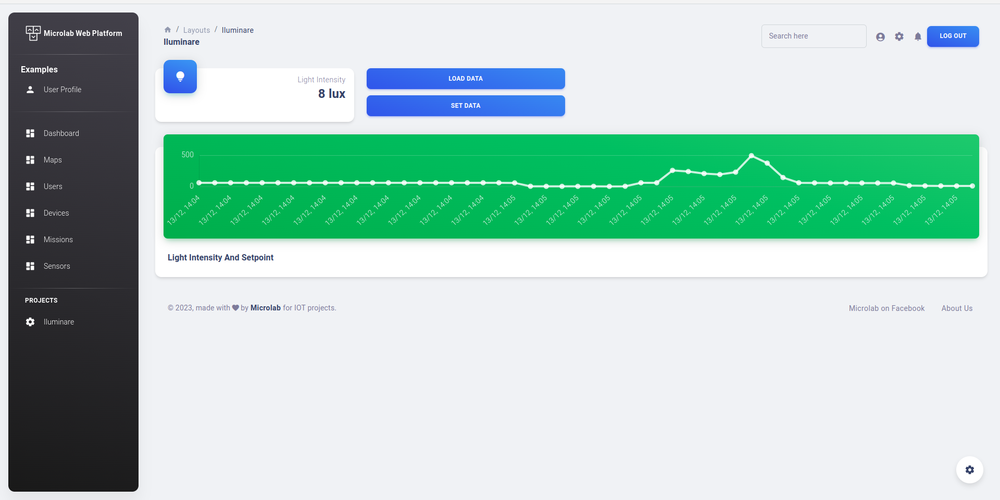

## Pagina Web pentru sistemul de control al iluminării

Sistem de control al iluminării în seră de la corpurile de iluminat.

1. Pagina web pentru vizualizarea datelor;
2. Transmiterea datelor către pagina de la MCU;
3. Preluarea datelor de pe pagina.

